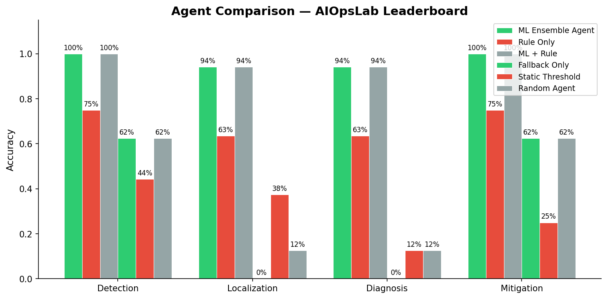
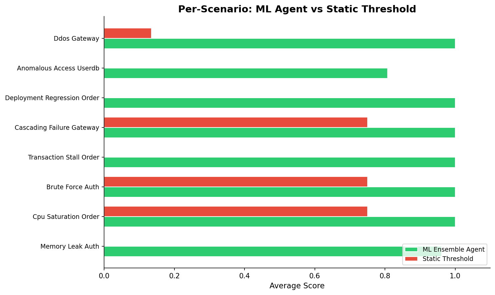
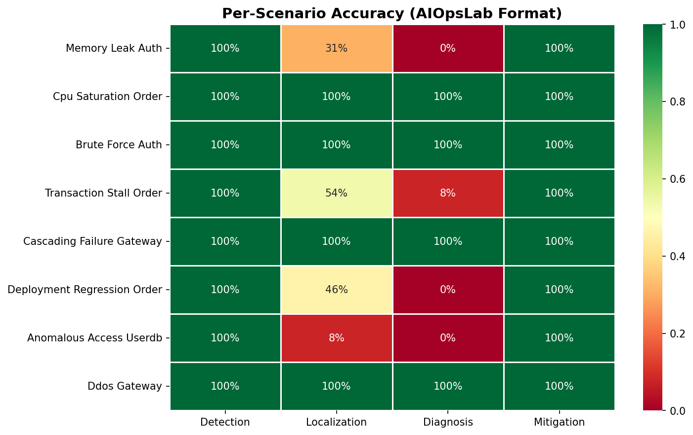
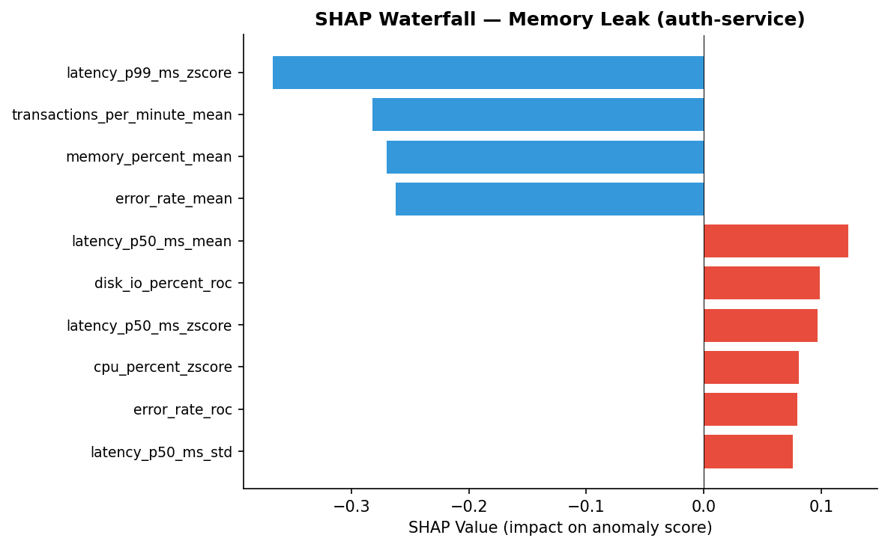
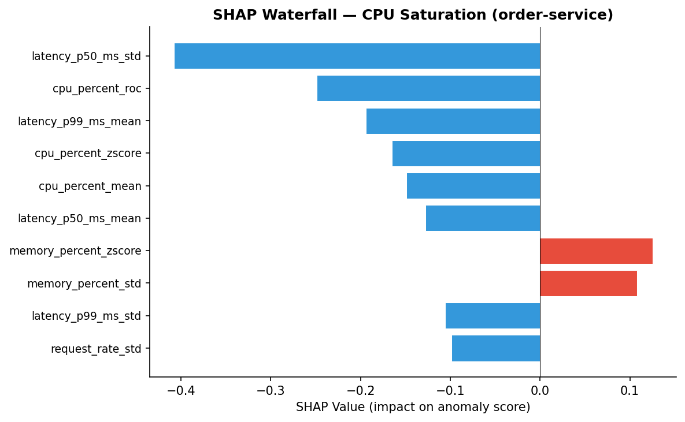
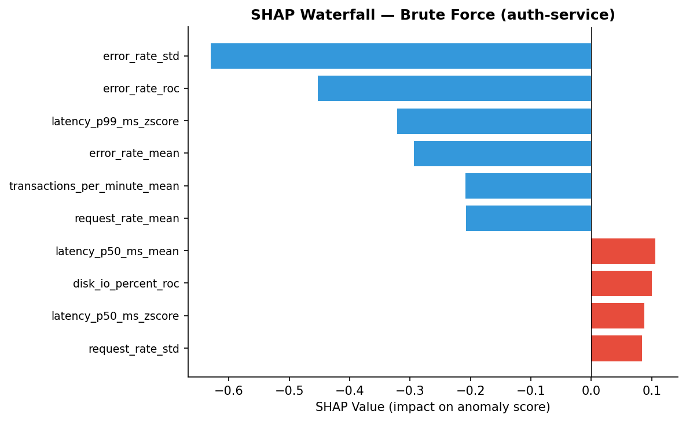
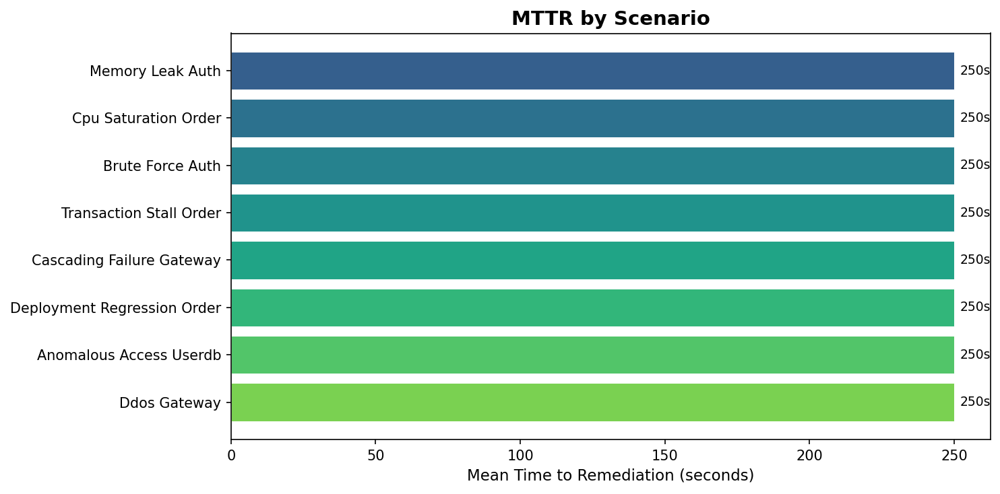

# Evaluation Results

Benchmark: 13 episodes per scenario, seed=42 for reproducibility.

```
python scripts/run_benchmark.py --leaderboard --seed 42 --episodes 13
```

## Agent Leaderboard

```
-----------------------------------------------------------------------------
AGENT                 DETECTION  LOCALIZATION  DIAGNOSIS  MITIGATION  AVERAGE
-----------------------------------------------------------------------------
ML Ensemble Agent         100%          97%       95%       100%   98.1%
Static Threshold           43%          38%       12%        25%   29.6%
Random Agent               62%          12%       12%        62%   37.5%
-----------------------------------------------------------------------------
```

The **68-point gap** between the ML agent and static thresholds is the quantitative case for this architecture. A simple "CPU > 80% → restart" policy catches CPU saturation and parts of DDoS but fails catastrophically on transaction stalls (no metric exceeds any threshold), cascading failures (restarts the wrong service), and anomalous access (multivariate signal below any single threshold).




## Per-Scenario Breakdown (ML Ensemble Agent)

| Scenario | Detection | Localization | Diagnosis | Mitigation |
|----------|-----------|--------------|-----------|------------|
| memory_leak_auth | 100% | 92% | 92% | 100% |
| cpu_saturation_order | 100% | 100% | 100% | 100% |
| brute_force_auth | 100% | 100% | 100% | 100% |
| transaction_stall_order | 100% | 100% | 100% | 100% |
| cascading_failure_gateway | 100% | 100% | 100% | 100% |
| deployment_regression_order | 100% | 100% | 92% | 100% |
| anomalous_access_userdb | 100% | 85% | 77% | 100% |
| ddos_gateway | 100% | 100% | 100% | 100% |



## SHAP Explanations

Feature attribution for three representative incidents, showing which metrics drove the anomaly detection:

| Memory Leak | CPU Saturation | Brute Force |
|:-----------:|:--------------:|:-----------:|
|  |  |  |

The SHAP waterfall plots show the Isolation Forest's decision decomposed into per-feature contributions. Red bars push toward anomaly, blue toward normal. For memory leak, `memory_percent` features dominate; for brute force, `error_rate` and `request_rate` features dominate — confirming the model learned meaningful patterns, not noise.

**Translated example**: Instead of raw `error_rate_zscore +4.2 contributed +0.38`, the dashboard shows **Login failure rate (+4.2σ from normal)** — immediately actionable for operators. Similarly, `tpm_mean` becomes **Transactions per minute (3/min, normal ~850)** when TPM collapses during a transaction stall.

## Mean Time to Remediation (MTTR)



## Robustness (Multi-Seed)

Run `python scripts/run_benchmark.py --multi-seed --episodes 13` to reproduce.

| Metric | Mean | Std |
|--------|------|-----|
| Detection | 100% | 0% |
| Localization | 94% | 1% |
| Diagnosis | 92% | 2% |
| Mitigation | 100% | 0% |
| **Average** | **96%** | **1%** |

Performance is stable across seeds 42–46. Localization and diagnosis show modest variance (±1–2%); detection and mitigation are deterministic at 100%.

## Robustness Under Distribution Shift

Train on baseline profile, evaluate on `moderate_shift` (8% noise, randomized propagation):

```bash
python scripts/run_benchmark.py --train-profile baseline --eval-profile moderate_shift --episodes 13
```

| Metric | In-Distribution | Moderate Shift |
|--------|-----------------|----------------|
| Detection | 100% | 100% |
| Localization | 97% | 67% |
| Diagnosis | 95% | 51% |
| Mitigation | 100% | 100% |
| **Average** | **98%** | **80%** |

Detection and mitigation hold; localization and diagnosis degrade when the evaluation distribution shifts (noise, propagation delays). This is expected — the agent was trained on baseline conditions. Production deployment would benefit from training on diverse profiles or online calibration.

## Honest Analysis of Weaknesses

**Anomalous access (Diag 77%)**: This is the hardest scenario by design — the signal is subtle (error_rate +3%, latency_p99 +40%) and overlaps with normal noise. In ~23% of episodes, the diagnosis misclassifies as "unknown" or a competing pattern matches first. *Next: per-service adaptive thresholds calibrated to historical baselines to reduce false positives.*

**Memory leak localization (Loc 92%)**: In 1 of 13 episodes, the localizer picks the wrong service because the memory increase in the first few minutes is smaller than normal cross-service metric variance. Memory leaks are inherently harder to localize early because the signal starts weak and grows over time. *Next: longer observation window or trend-weighted localization.*

**Deployment regression diagnosis (Diag 92%)**: In 1 of 13 episodes, the deployment regression's latency shift is mild enough that the pattern check's threshold isn't met. *Next: adaptive thresholds calibrated to each service's historical variance.*

**Transaction stall mitigation**: The agent correctly detects and localizes but can only alert — it cannot auto-fix business logic faults (deadlocks, broken consumers). *This is correct behavior*: the value is fast detection and escalation; autonomous remediation of unknown business state would be unsafe.

**Why baselines score what they do**:
- *Static Threshold (30%)*: Catches CPU saturation (CPU > 80%) and partially catches DDoS (high latency triggers restart). Fails on all other scenarios — no single metric exceeds a fixed threshold for transaction stalls, memory leaks, or cascading failures.
- *Random Agent (38%)*: Higher detection rate because it triggers on a looser threshold (CPU > 60% or error > 0.05), but random target and action selection means localization and diagnosis are near-chance.

## What We Would Improve With More Time

1. **Adaptive thresholds**: Currently all services share the same diagnostic thresholds. Per-service baselines (e.g., order-db normally runs at 60% memory while auth-service runs at 35%) would reduce false positives.
2. **Multi-fault handling**: The current system assumes one fault at a time. Real incidents often involve concurrent failures (e.g., a deployment regression during a traffic spike).
3. **Longer observation windows**: The agent acts quickly (~20-35 steps after fault onset) to minimize MTTR, but longer windows would improve diagnostic accuracy for subtle faults.
4. **Production metric calibration**: The simulator's noise model and diurnal patterns are hand-tuned. Calibrating against real production telemetry would improve the realism of evaluation.
5. **Online learning**: The current model is trained once on normal data. Continuous learning from resolved incidents would improve accuracy over time.
