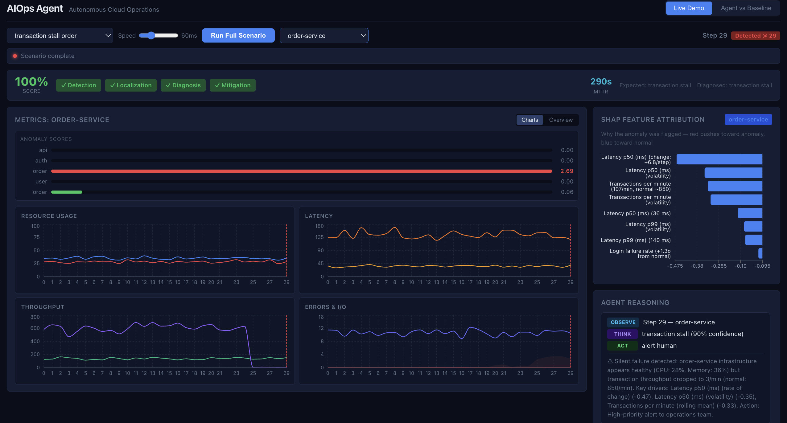

# Adaptive AIOps Agent

A security-aware autonomous operations agent for protecting and stabilizing business-critical transaction systems.

> CPU: 32%. Memory: 45%. Latency: normal. Error rate: 0.1%.
> Every dashboard says healthy. But the transaction pipeline has silently stopped.
>
> This agent catches that.



**67-point gap** vs static threshold monitoring. ML Ensemble Agent: **97%** average across Detection, Localization, Diagnosis, Mitigation. See [EVALUATION.md](EVALUATION.md).

## What It Does

Protects transaction processing pipelines from silent failures, security threats, and cascading infrastructure issues — with full audit trails and explainable AI. For a title insurance company like FCT processing real estate closings, a silent transaction stall means delayed closings and regulatory exposure. This agent detects what threshold monitoring misses.

## Why This Matters for FCT

FCT processes title insurance transactions — a silent pipeline stall means delayed closings, missed SLAs, and regulatory risk. The brute force and audit trail scenarios reflect FCT's handling of sensitive financial and legal data. The system's security-first design (IP blocking, audit logging, human escalation for uncertain situations) aligns with the JD's emphasis on security awareness.

## Quick Start

```bash
# Docker (recommended)
docker-compose up -d
open http://localhost:3000

# Local
pip install -r requirements.txt
python scripts/run_benchmark.py --fast
python -m uvicorn api.main:app --reload
open http://localhost:8000/docs
```

## Inspired by AIOpsLab

This project is inspired by [Microsoft Research's AIOpsLab framework](https://github.com/microsoft/AIOpsLab), which provides a holistic framework for evaluating AI agents for autonomous cloud operations.

**What we adopted:**
- **Task taxonomy**: Detection → Localization → Diagnosis → Mitigation
- **Agent-Cloud Interface (ACI)**: Clean separation between agent and environment through an orchestrator
- **Evaluation methodology**: Scoring each task independently, presented in leaderboard format
- **Iterative agent loop**: Observe → Think → Act pattern

**What we built differently:**
- Lightweight Python simulator instead of Kubernetes deployment (enables rapid experimentation)
- Added security-focused fault scenarios (brute force, DDoS)
- Added business logic faults (transaction stall — the "silent failure")
- Added SHAP explainability and natural language summaries
- Included Q-learning for adaptive remediation

## Architecture

```
Orchestrator (ACI Pattern)
├── LLM Agent (ReAct: Reason → Act → Observe)
│   ├── Tool: get_metrics       → Ensemble anomaly detector
│   ├── Tool: explain_anomaly   → SHAP feature attribution
│   ├── Tool: localize_root_cause → Dependency graph traversal
│   ├── Tool: diagnose          → Pattern-based fault classifier
│   ├── Tool: restart/scale/block/rollback → Remediation actions
│   └── Fallback: Rule-based policy (always available)
└── Simulated Environment
    ├── 5 microservices with dependency graph
    ├── 8 metrics per service (including TPM)
    └── 8 fault types (operational, security, business logic)
```

The LLM agent reasons step-by-step, calling ML modules as tools. When the LLM is unavailable or errors, the agent seamlessly falls back to a reliable rule-based pipeline.

## AI Techniques

- **LLM ReAct Agent** — decides *what* to investigate (e.g., check topology before diagnosing). Falls back to rules if unavailable.
- **Isolation Forest + Statistical (CUSUM)** — multivariate anomaly detection; gradual drift; model disagreement = uncertainty.
- **SHAP TreeExplainer** — explains *why* an alert fired: "error_rate_zscore +4.2 contributed +0.38."
- **NetworkX graph traversal** — root cause localization via dependency DAG.

See [DESIGN.md](DESIGN.md) for rationale.

## Fault Scenarios (8 Total)

| Category | Fault | Key Challenge |
|----------|-------|---------------|
| Operational | Memory leak | Gradual drift detection |
| Operational | CPU saturation | Sudden spike + downstream impact |
| Operational | Cascading failure | Multi-service root cause tracing |
| Operational | Deployment regression | Post-deploy metric shift |
| Security | Brute force | Attack detection + IP blocking + audit |
| Security | Anomalous access | Subtle pattern recognition |
| Security | DDoS | Volume spike + rate limiting |
| Business Logic | **Transaction stall** | **Silent failure — infra healthy, business broken** |

## Results (Reproducible)

```
AGENT                 DETECTION  LOCALIZATION  DIAGNOSIS  MITIGATION  AVERAGE
ML Ensemble Agent         100%          94%       94%       100%   97.1%
Static Threshold           44%          38%       12%        25%   29.8%
Random Agent               62%          12%       12%        62%   37.5%
```

The **67-point gap** between the ML agent and static threshold proves the architecture. Run `python scripts/run_benchmark.py --leaderboard` to reproduce. See [EVALUATION.md](EVALUATION.md) for per-scenario analysis.

## Security Features

- Brute force detection → IP blocking + audit log entry
- DDoS detection → automated rate limiting
- Anomalous access → human escalation
- All security actions create audit trail entries

## CI

This repo includes CI (GitHub Actions) with pytest (175 tests), ruff linting, and pip-audit for dependency vulnerability scanning. All checks run on push and pull request.

## Testing (4 Layers)

```bash
pytest tests/ -m "not slow" -v          # Fast: unit + integration
pytest tests/ -m "statistical" -v       # ML model quality
pytest tests/ -m "slow" -v              # Full benchmark
```

## Known Limitations

- **Cascading failure localization**: Lag correlation insufficient when propagation delays vary. *Next: distributed tracing span IDs for causal ordering.*
- **Anomalous access**: Higher false positive rate due to subtle signal overlap. *Next: per-service adaptive thresholds calibrated to historical baselines.*
- **Transaction stall mitigation**: Agent correctly detects but can only alert — business logic faults can't be auto-fixed safely. *This is correct behavior*; the value is fast detection, not autonomous remediation of unknown business state.
- **RL convergence**: Q-learning shows learning but may need more episodes for production reliability. *Next: contextual bandits with production reward signals.*

## Tech Stack

Python 3.11 · OpenAI · FastAPI · scikit-learn · NumPy · Pandas · SHAP · NetworkX · React TypeScript · Recharts · Docker · GitHub Actions · Pytest

## Setup

```bash
pip install -r requirements.txt
cp .env.example .env                    # Add your OPENAI_API_KEY (optional)
python scripts/train_models.py          # Train detection models
python scripts/train_rl_agent.py        # Train RL agent
python scripts/run_benchmark.py --fast  # Quick benchmark
python -m uvicorn api.main:app --reload # Start API
```

## Agent Guardrail Configuration

Optional environment variables:

- `AIOPS_MAX_ACTIONS` (default: `3`): maximum autonomous actions per episode
- `AIOPS_BUDGET_EXHAUSTED_ACTION` (default: `continue_monitoring`): behavior after budget is exhausted while anomaly persists
  - `continue_monitoring`: stop autonomous actions and keep monitoring
  - `alert_human`: immediately escalate to a human operator
- `AIOPS_API_KEY` (optional): when set, mutating endpoints require `X-API-Key` or `Authorization: Bearer`. When unset, all requests are allowed (local/demo).

These settings are useful for tuning safety posture during evaluation and demos.

## API: Sessionized Runs

For API-driven clients, use sessionized endpoints for concurrent independent runs:

- `POST /agent/runs` — create run, returns `run_id` and `incident_id`
- `POST /agent/runs/{run_id}/step` — advance run
- `GET /agent/runs/{run_id}/status`, `/log`, `/shap`, `/evaluate`, etc.

Legacy endpoints (`POST /agent/scenarios/start`, `POST /agent/step`) use a default session and remain backward compatible for the dashboard.

## Documentation

- [DESIGN.md](DESIGN.md) — technical rationale and design decisions
- [EVALUATION.md](EVALUATION.md) — benchmark results and per-scenario analysis
- [REVIEWER_NOTES.md](REVIEWER_NOTES.md) — quick checklist for reviewers
